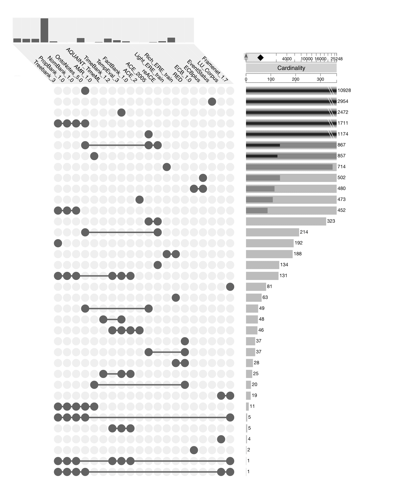

## Corpus Comparison

This repository contains an overview of the document intersections of language resources. It is described in the following paper:

```
Chantal van Son, Oana Inel, Roser Morante, Lora Aroyo and Piek Vossen (2018). Resource Interoperability for Sustainable Benchmarking: The Case of Events. In Proceedings of the 11th International Conference on Language Resources and Evaluation (LREC 2018), Miyazaki, Japan. [pdf](https://www.aclweb.org/anthology/L18-1178)
```


### Language Resources

Currently, the filenames of the following annotated corpora are compared (more corpora may be added in the future):

- Penn TreeBank-3 ([LDC99T42](https://catalog.ldc.upenn.edu/LDC99T42))
- Proposition Bank I ([LDC2004T14](https://catalog.ldc.upenn.edu/LDC2004T14)) 
- NomBank v1.0 ([LDC2008T23](https://catalog.ldc.upenn.edu/LDC2008T23))
- OntoNotes Release 5.0 ([LDC2013T19](https://catalog.ldc.upenn.edu/LDC2013T19))
- FrameNet 1.7 ([FrameNet website](https://framenet.icsi.berkeley.edu/fndrupal/))
- Abstract Meaning Representation (AMR) Annotation Release 1.0 ([LDC2014T12](https://catalog.ldc.upenn.edu/LDC2014T12))
- TimeBank 1.2 ([LDC2006T08](https://catalog.ldc.upenn.edu/LDC2006T08))
- AQUAINT TimeML ([ELRA-U-W0394](http://universal.elra.info/product_info.php?cPath=42_43&products_id=2333)), also available [here](https://github.com/cnorthwood/ternip/tree/master/sample_data/aquaint_timeml_1.0)
- TempEval-3 ([Task website](https://www.cs.york.ac.uk/semeval-2013/task1/index.html))
- FactBank 1.0 ([LDC2009T23](https://catalog.ldc.upenn.edu/LDC2009T23))
- ACE-2 ([LDC2003T11](https://catalog.ldc.upenn.edu/LDC2003T11))
- ACE 2005 Multilingual Training Corpus ([LDC2006T06](https://catalog.ldc.upenn.edu/LDC2006T06))
- Datasets for Generic Relation Extraction (reACE) ([LDC2011T08](https://catalog.ldc.upenn.edu/LDC2011T08))
- ECB 1.0 Corpus (used to be available [here](http://faculty.washington.edu/bejan/data/ECB1.0.tar.gz), but link has expired)
- ECB+ Corpus (available at the [NewsReader website](http://www.newsreader-project.eu/results/data/the-ecb-corpus/))
- Richer Event Description ([LDC2016T23](https://catalog.ldc.upenn.edu/LDC2016T23))
- TDT4 Multilingual Text and Annotations ([LDC2005T16](https://catalog.ldc.upenn.edu/LDC2005T16))
- Light ERE training data (not officially published yet; see [this paper](http://www.aclweb.org/old_anthology/W/W15/W15-0812.pdf))
- Rich ERE training data (not officially published yet; see [this paper](http://www.aclweb.org/old_anthology/W/W15/W15-0812.pdf))
- The EventStatus Corpus ([LDC2017T09](https://catalog.ldc.upenn.edu/LDC2017T09))
- The Language Understanding (LU) Annotation Corpus ([LDC2009T10](https://catalog.ldc.upenn.edu/LDC2009T10))

Note that for all multilingual resources, only the English parts have been taken into account. 

For the Penn Treebank and PropBank I have used the [`ptb` package](http://www.nltk.org/howto/corpus.html) from NLTK to obtain all filenames contained in the corpora. For all other corpora, the analysis is based on the files in the `data/filelists` folder specifying all files contained in the corpora. Most of them can be directly downloaded from the LDC website (if you are a member of LDC) or are included in the distributions. Some of them were generated by me, others were kindly send to me by the creators of the corpora. 

### Content

This repository contains the following:

- `data/filelists`: This folder contains the files specifying all filenames (sometimes with the complete path) contained in each corpus. 
- `data/mappings.csv`: This file maps the original filenames (or filepaths) to the uniform filenames that have been used to analyse the intersections.
- `data/intersections.csv`: This file uses a binary encoding for representing the intersections of the corpora. It can loaded into the UpSet visualization tool (see below).
- `data/upset.json`: This `json` file describes the data contained in `intersections.csv` and is used to load it into the UpSet Web Version (see below).

### UpSet Visualization

The intersections of the corpora can be visualized using [UpSet](http://caleydo.org/tools/upset/). There are multiple ways to use the UpSet visualization tool:

1. [UpSet Web Version](http://vcg.github.io/upset):  For an interactive visualization, go to the UpSet Web Version, choose `Load Data` and paste the following link: https://raw.githubusercontent.com/ChantalvanSon/CorpusComparison/master/data/upset.json
2. [UpSetR Shiny App](https://gehlenborglab.shinyapps.io/upsetr/) For a static visualization, go to the UpSetR Shiny App and upload [this document](https://raw.githubusercontent.com/ChantalvanSon/CorpusComparison/master/data/intersections.csv) (can be found under `data`).
3. [UpSetR](https://github.com/hms-dbmi/UpSetR): Install the UpSetR package in R and create the plot using [this document](https://raw.githubusercontent.com/ChantalvanSon/CorpusComparison/master/data/intersections.csv) (can be found under `data`).
4. [pyUpSet](https://github.com/ImSoErgodic/py-upset): Install pyUpSet in Python to create the plot; this will need some more pre-processing and the visualizations are not as nice as the other methods.



